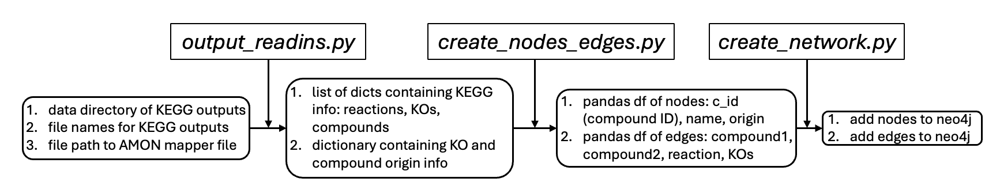

# Creating co-metabolism networks using neo4j 

The flow chart is an explanation of inputs and outputs used in the workflow found in *main.py*.

Also, in *main.py* class of Neo4jConnection will be created which is necessary for network creation in neo4j.

